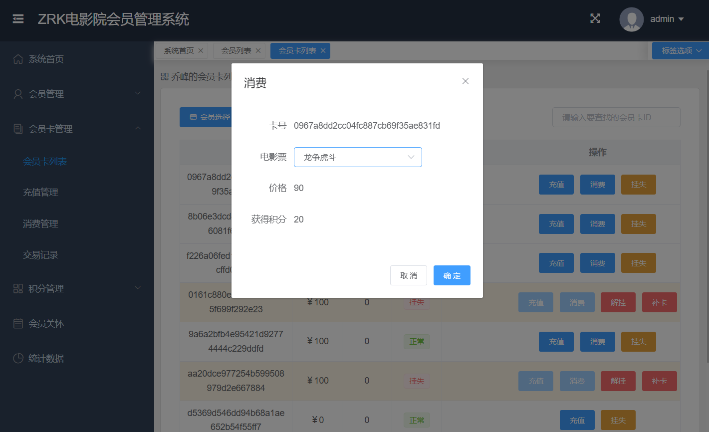

### 作者QQ：1556708905(支持修改、 部署调试、 支持代做毕设)

#### 支持代做任何毕设论、接网站建设、小程序、H5、APP、各种系统等

**毕业设计所有选题地址 [https://github.com/zhengjianzhong0107/allProject](https://github.com/zhengjianzhong0107/allProject)**

**博客地址：[https://blog.csdn.net/2303_76227485/article/details/128658864](https://blog.csdn.net/2303_76227485/article/details/128658864)**

**视频演示：[https://space.bilibili.com/384537280](https://space.bilibili.com/384537280)**

 
## 基于Springboot+vue电影院会员管理系统(源代码+数据库+文档)

## 一、系统介绍

- cinema项目是一套电影院会员管理系统，使用前后端分离架构开发  
- 包含管理员、会员管理、会员卡管理、电影票、消费记录、数据统计等模块

## 二、所用技术

后端技术栈：

- Springboot + Mybatis + Swagger2 + Maven +mysql

前端技术栈：

- Vue.js
- Element UI

## 三、环境介绍

基础环境 :IDEA/eclipse, JDK 1.8, Mysql5.7及以上,Node.js,Maven

所有项目以及源代码本人均调试运行无问题 可支持远程调试运行

## 四、项目截图

### 流程图

     

## 五、浏览地址

http://localhost:8081/#/login

用户名：admin  密码：123123     

## 六、安装教程

1. 使用Navicat或者其它工具，在mysql中创建对应名称的数据库，并导入项目的sql文件；
2. 使用IDEA/Eclipse导入项目，若为maven项目请选择maven;导入成功后请执行maven clean;maven install命令，然后运行；
3. 修改application.yml 里面的数据库配置
4. 启动项目后端项目 
5. vscode打开cinema-web项目，
6. 打开终端，执行npm install 依赖下载完成后执行 npm run dev,执行成功后会显示访问地址
7. 访问  http://localhost:8080/ 

* 方法一: cinema项目中已经整合了vue打包的静态资源，直接启动项目，并在浏览器上输入http://localhost:8081/cinema 即可运行。                                                                         
* 方法二: cinema-web项目是cinema项目的vue单页面前端项目，可以在文件夹目录下命令行输入：
  `npm run install`                                                                                          
  `npm run dev`
  后，修改utils/request.js下baseURL=”/api”,开启node反向代理服务器,解决跨域问题,然后启动cinema后端项目，在浏览器上输入 http://localhost:8080 即可以前后端分离方式运行(也可以npm run build后将dist文件夹放到nginx下运行)

## 使用说明

* 数据库文件cinema.sql已整合到项目中，使用mysql导入即可生成数据库
* 本项目已经整合了前后端，前端文件经过webpack构建后，生成了static文件夹和index.html放入了webapp下。
* 要对前端页面进行修改，需要同时git[cinema-web前端项目地址](https://github.com/ynwynw/cinema-public/cinema-web)，修改完成后
  同样将生成的文件放到本项目的webapp下。    
* 需上交的程序设计文档可参考目录下:cinema项目文档.docx  
 